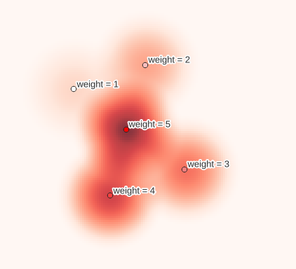

# Spatial Kernel Density Esimation
Create Spatial Kernel Density / Heatmap (as a numpy array or raster) from point based vector data, à la QGIS / ArcGIS.

Creates a kernel density (heatmap) raster from vector point data using kernel density estimation. The density is calculated based on the number of points in a location, with larger numbers of clustered points resulting in larger values, and points can be optionally weighted. Kernel Density / Heatmaps allow easy for identification of hotspots and clustering of points. This implementation provides an equivalent to [QGIS' Heatmap](https://docs.qgis.org/3.16/en/docs/user_manual/processing_algs/qgis/interpolation.html#heatmap-kernel-density-estimation) and [ArcGIS/ArcMap/ArcPro's Kernel Density spatial analyst](https://pro.arcgis.com/en/pro-app/latest/tool-reference/spatial-analyst/kernel-density.htm) function.

The implementation of Kernel Density here uses the Quartic kernel for it's estimates, with the methodology equivialent to the ArcGIS documentation explaining how [Kernel Density](https://pro.arcgis.com/en/pro-app/latest/tool-reference/spatial-analyst/how-kernel-density-works.htm) works. There are many alternative KDE functions available in python that may offer better performance, for example [scipy](https://docs.scipy.org/doc/scipy/reference/stats.html#univariate-and-multivariate-kernel-density-estimation), [scikit-learn](https://scikit-learn.org/stable/modules/generated/sklearn.neighbors.KernelDensity.html), [KDEpy](https://kdepy.readthedocs.io/en/latest/index.html), though these alternatives may not perform KDE in the same manner as GIS software (namely the Quartic kernel with optional weights).

## Installation

## Usage

## Development

Prequisites:

* [poetry](https://python-poetry.org/)
* [pre-commit](https://pre-commit.com/)

The Makefile includes helpful commands setting a development environment, get started by installing the package into a new environment and setting up pre-commit by running `make install`. Run `make help` to see additional available commands (e.g. linting, testing and so on).

* [Pytest](https://docs.pytest.org/en/6.2.x/) is used for testing the application (see `/tests`).
* Code is linted using [flake8](https://flake8.pycqa.org/en/latest/)
* Code formatting is validated using [Black](https://github.com/psf/black)
* [pre-commit](https://pre-commit.com/) is used to run these checks locally before files are pushed to git
* The [Github Actions pipeline](.github/workflows/pipeline.yml) runs these checks and tests

## TODO

- [ ] Github actions pipeline runs on a matrix of python versions
- [ ] Documentation (e.g. mkdocs, read-the-docs w/ sphinx or similar)
- [ ] Tooling for managing versioning/releasing (e.g. bump2version)
- [ ] Makefile commands for releasing to (test) pypi